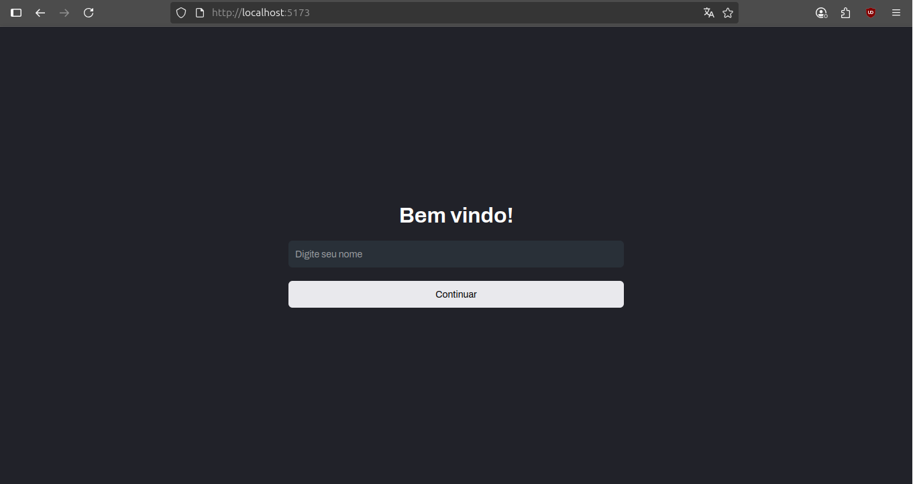
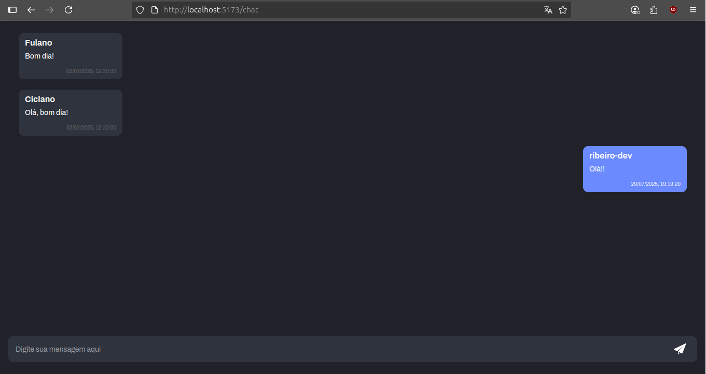

# Real-Time Chat App

Um chat em tempo real, utilizando websocket com Socket.IO. Está separado em duas aplicações: [front-end](https://github.com/ribeiro-dev/realtime-chat-fe) e [back-end](https://github.com/ribeiro-dev/realtime-chat-api) (API)

Esse projeto é uma recriação de um antigo [projeto pessoal](https://github.com/ribeiro-dev/chat-realtime). Na época em que o criei, foi algo muito avançando para mim. E apesar de funcional, era um código muito bagunçado

Eu poderia simplesmente refatorar o código no projeto antigo, mas preferi criar um novo para comparar e ver o quanto evoluí nesse tempo que passou

---

## 📸 Preview

---

## 🧑‍💻 Tech Stack

- **React + Vite**
- **TypeScript**
- **Socket.IO**
- **Styled Components**

